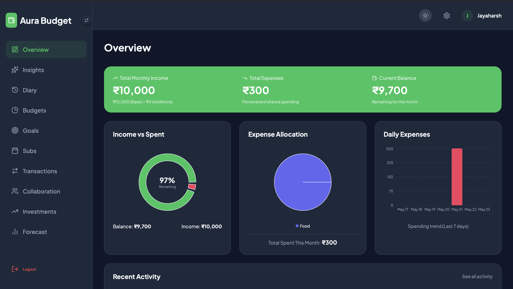

# Aura Budget 💸

Aura Budget is an AI-powered personal finance management web application that combines transaction tracking, budget planning, investment tracking, goal management, and collaborative shared budgets — all enhanced by LLM-powered insights and ML-based spending forecasts.

## 📸 Homescreen


## ✨ Key Features

- **Dashboard & Overview**: Visual summary of income versus expenses.
- **AI Financial Insights & Builder**: Uses Groq (LLaMA 3.3 70B) to generate budget plans from descriptions and personalized financial insights.
- **ML Spending Forecast**: Python-based Machine Learning models (Random Forest) that forecast your future spending patterns.
- **AI Voice & Text Diary**: "Describe Your Day" using voice or text. Uses OpenAI Whisper for voice-to-text and LLaMA to parse your day into structured transactions, subscriptions, or goals.
- **Collaborative Budget Rooms**: Multi-user shared budgets with real-time updates via Socket.IO.
- **Investment Tracking**: Keep track of your portfolio (stocks/crypto) with real-time price lookups via Alpha Vantage.
- **Goal Management**: Save up for specific targets with AI-powered insights.
- **Subscriptions**: Track recurring expenses easily.
- **Data Export**: Export your transaction reports as PDF.

## 🛠️ Technology Stack

### Frontend
- **Framework**: React 18 (Vite)
- **Styling & UI**: Lucide React, Framer Motion for animations
- **Charts**: Recharts
- **Real-time**: Socket.IO Client
- **State Management**: React useState hooks

### Backend
- **Framework**: Node.js & Express 5
- **Database**: MongoDB Atlas via Mongoose 9
- **Authentication**: JWT & bcryptjs
- **Real-time**: Socket.IO 4
- **AI/ML Integration**: 
  - Python / scikit-learn for forecasting (Random Forest)
  - Groq SDK (LLaMA 3.3) for insights & parsing
  - Google Generative AI (Gemini API)
  - OpenAI Whisper for audio transcription

## 🚀 Getting Started

### Prerequisites
- Node.js (v18+)
- Python (v3.8+) for ML scripts
- MongoDB instance (Atlas or local)

### Installation

1. **Clone the repository:**
   ```bash
   git clone https://github.com/JayaharshM/Aura-Budget.git
   cd Aura-Budget
   ```

2. **Backend Setup:**
   ```bash
   cd backend
   npm install
   # Create a .env file based on the environment variables needed
   # Make sure you have python dependencies installed
   pip install -r ml/requirements.txt
   npm start
   ```

3. **Frontend Setup:**
   ```bash
   cd ../frontend
   npm install
   npm run dev
   ```

### Environment Variables
You will need to create a `.env` file in the `backend` directory with the following keys:
- `MONGODB_URI`: MongoDB connection string
- `JWT_SECRET`: Secret for JSON Web Tokens
- `GROQ_API_KEY`: API key for Groq LPU
- `GEMINI_API_KEY`: API key for Google Gemini
- `OPENAI_API_KEY`: API key for OpenAI Whisper
- `ALPHA_VANTAGE_API_KEY`: API key for stock data
- `EXCHANGE_RATE_API_KEY`: API key for currency exchange

## 🤝 Collaboration
Invite users to your budget rooms using codes and seamlessly track shared expenses with real-time sync.

## 📄 License
This project is for the SRP Project by JayaharshM.
